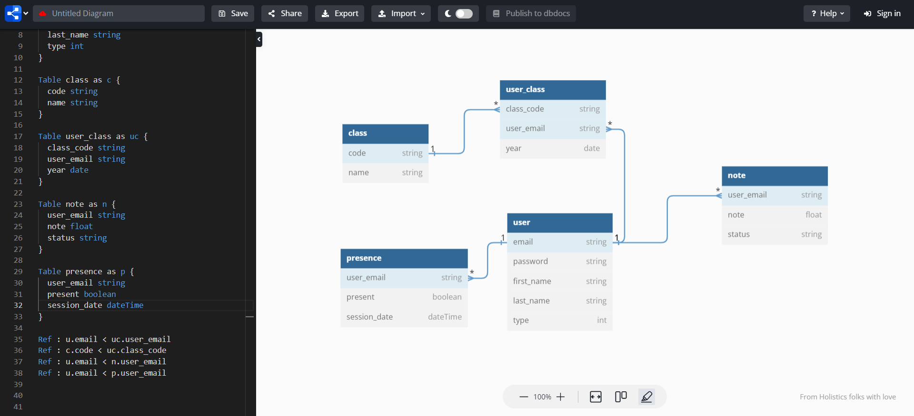
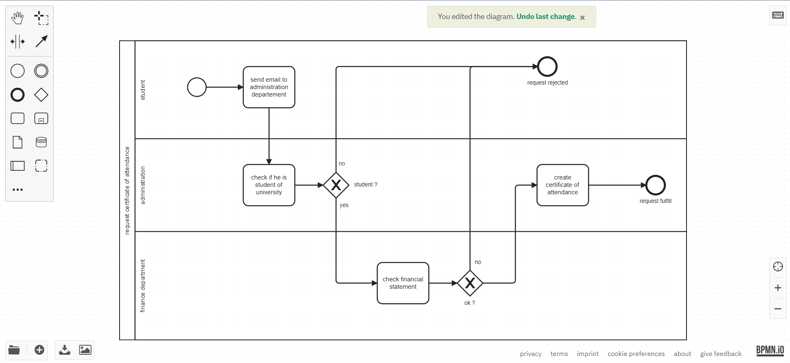

# Aziz Khlayfia (class : DMWM-2-a)

## books

use `npm install` then `npm start` to start work with it.

## project

### database diagram :



### how to run using docker compose :

```bash
$ docker compose up -d
```

after everything is done. you can run application on `localhost:80`

### bpmn (request certi ) :


